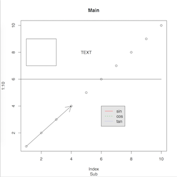

#Rの基本操作

##対話型起動&終了+α

	$ R              # 起動
	> x <- rnorm(50) # 正規乱数生成
	> y <- rnorm(50) # 正規乱数生成
	> ls()           # 作業スペースのオブジェクト参照
	[1] "x" "y"
	> rm(x, y)       # 不要なオブジェクトを掃除
	> ls()           # 作業スペースのオブジェクト参照
	character(0)
	> q()            # 終了

##電卓機能
1. 計算式を入力し、[enter]キーを押す

		> 1+2
		[1] 3
		> sqrt(2)
		[1] 1.414214
		

	<dl>
  	<dt><b>演算子</b></dt>
  	<dd>+</dd>
  	<dd>-</dd>
  	<dd>*</dd>
  	<dd>/</dd>
  	<dd>^</dd>
  	<dd>%/%　整数商</dd>
  	<dd>%%　剰余</dd>
  	<dt><b>数学関数</b></dt>
  	<dd>sin(x)</dd>
  	<dd>cos(x)</dd>
  	<dd>tan(x)</dd>
  	<dd>log(x)</dd>
  	<dd>log10(x)</dd>
  	<dd>exp(x)</dd>
  	<dd>sqrt(x)</dd>
  	<dd>abs(x)</dd>
  	<dd>trunc(x)　整数部分</dd>
  	<dd>round(x)　丸め</dd>
  	<dd>floor(x)　切り下げ</dd>
  	<dd>ceiling(x)　切り上げ</dd>
	</dl>

2. 変数へ代入

		> x <- log(2)  # log(2)を変数xに代入
		> x            # 変数xの中身表示
		[1] 0.6931472
		> help(log)    # 関数log()に関するヘルプ表示
3. ベクトル化
	
	Rでは実数，複素数，文字列，論理数などの基本的データを一つずつ単独で扱う代わりに，同じ型のデータをいくつかまとめたベクトルと呼ばれる形で取り扱う
	
		> x <- c(50,55,60,65,70)
		> y <- sum(x)  # 総和
		> y
		[1] 300
		> mean(x)      # 平均
		[1] 60

	<dl>
  	<dt><b>ベクトル用関数</b></dt>
  	<dd>cor(x,z)　相関係数</dd>
  	<dd>max(x)　最大値</dd>
  	<dd>mean(x)　平均値</dd>
  	<dd>median(x)　中央値</dd>
  	<dd>min(x)　最小値</dd>
  	<dd>prod(x)　総積</dd>
  	<dd>summary(x)　要約統計量</dd>
  	<dd>sd(x)　標準偏差</dd>
  	<dd>sum(x)　総和</dd>
  	<dd>var(x)　不偏分散</dd>
	</dl>
	
	
4. 練習問題

	10人の体重（50,60,70,60,45,55,80,90,75,60）の平均値、合計値、中央値、最大値、最小値を算出せよ

## 行列計算
1. 行列の要素をベクトルで準備
2. 関数matrix(ベクトル、行数、列数)でべくおるから行列に変換
		
		> x <- c(1,2,3,4,5,6)
		> A <- matrix(x, 2, 3)
		> A
		     [,1] [,2] [,3]
		[1,]    1    3    5
		[2,]    2    4    6

	<dl>
  	<dt><b>演算子</b></dt>
  	<dd>+　加算</dd>
  	<dd>-　減算</dd>
  	<dd>%\*%　行列の積</dd>
  	<dd>\* 対応する要素同士のの積</dd>
	</dl>

## 乱数生成関数
+ rnorm(10, mean=0, sd=1)
	+ 平均 0，標準偏差 1の正規分布に従う乱数を10個
+ rpois(10, lambda=2)
	+ パラメータ 2のポアソン分布に従う乱数を10個
+ runif(10, min=0, max=1)
	+ (0, 1) 区間の一様乱数を10個
+ rexp(10, rate=1)
	+ パラメーター1の指数分布に従う乱数を10個	
	
			
## 関数作成
1. 関数名(myfunc)を決める
2. 変数の個数と種類を指定
3. 計算手順を 1 行ずつ記述し最後に関数 return() で計算結果を出力		

		> myfunc <- function(x, y) {
		+   return (x*y)
		+ }
		> myfunc(2, 5)                # 関数を実行				
		[1] 10
		
4. 練習問題

	関数 f(x) = 2xをRで定義、x=3の場合の値を求めよ		

	
## グラフ作成

1. グラフを描く

	+ 高水準作図関数：１枚の完成された図を描く
	+ 低水準作図関数：図形や文字などを追記する 

		<dl>
  		<dt><b>高水準作図関数</b></dt>
  		<dd>barplot(...)　棒グラフ</dd>
  		<dd>pie(...)　円グラフ</dd>
  		<dd>plot(...)　時系列データのプロット</dd>
  		<dd>persp(...)　2変数関数グラフ</dd>
  		<dt><b>低水準作図関数</b></dt>
  		<dd>points()　点</dd>
  		<dd>lines()　直線</dd>
  		<dd>grid()　格子</dd>
  		<dd>arrows()　矢印</dd>
  		<dd>rect()　短形</dd>
  		<dd>text()　文字</dd>
  		<dd>title()　タイトル</dd>
  		<dd>legend()　凡例</dd>  	
		</dl>
	
			> plot(1:10)               # 散布図を描く
			> lines(c(0,10), c(6,6))   # 水平線を追記
			> rect(1, 7, 3, 9)         # 短形を追記
			> arrows(1, 1, 4, 4)       # 矢印を追記
			> text(5, 8, "TEXT")       # 文字を追記
			> title("Main", "Sub")     # タイトルを追記
			> legend(6, 4,
			+ c("sin", "cos", "tan"),
			+ col=2:4, lty=1:3,
			+ bg='gray90')             #凡例を追記 
		
		
	
2. 練習問題

	関数 f(x) = 2x^2をRで定義、グラフを作成せよ		
