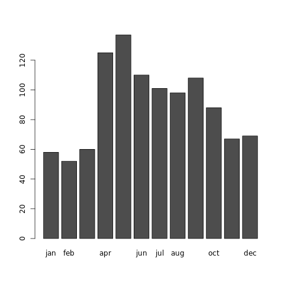
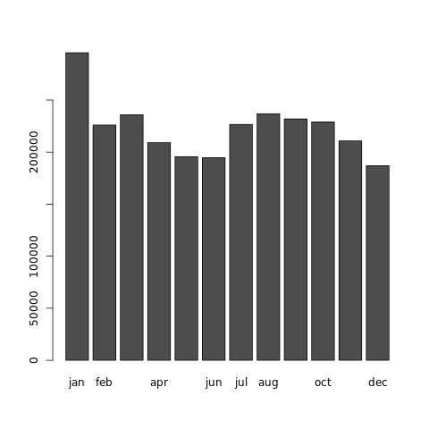

# 統計解析入門1
## データ形式 

###ベクトル

Rに特有のデータ形式の名前です。ベクトルとは，要するに複数の数字などを1つにまとめたものです。
「変数」で代入操作した結果はすべてベクトルです。下の実行例でXはベクトルです。

	> X <- c(3, 6, 8)
	> X
	[1] 3  6  8
		      

###データフレーム 

データフレーム は，Excelなどの表計算ソフトで言うシートに近いものです。たとえばRのコンソールで cars とだけ入力してEnterを押すと，次のような表示が出ます（後半の出力部分は掲載を省略しました）。

	> cars
	   speed dist
	1      4    2
	2      4   10
	3      7    4
	4      7   22
	5      8   16
	6      9   10
	7     10   18
	8     10   26
	9     10   34
	10    11   17		      
		      

左端の数値はデータそのものではなく，データの行数を表してます。列数と行数に制限はありません。
cars データには2つの列があります。speed と dist です（走行速度と停止までの距離）。 このような形式で保存されたデータをRではデータフレームといいます。

###添字

データの順番を表す概念に添字があります。添字を使うと

データフレームから特定の列や行だけを取り出すことができます。
まずデータフレームから特定の列をまるまる取り出すには「$」を使います。

	> cars$speed
	 [1]  4  4  7  7  8  9 10 10 10 11 11 12 12 12 12 13 13 13
	[19] 13 14 14 14 14 15 15 15 16 16 17 17 17 18 18 18 18 19
	[37] 19 19 20 20 20 20 20 22 23 24 24 24 24 25		      
		      

一番左端に[1],[19],[37]というのは，データではありません。その右隣に表示されている数値が，データの何番目の要素であるかを示す表示です。たとえば[19]はその右にある13が，carsデータの speed 列の19番目（carsデータの19行目）の要素であることを意味します。[37]の隣の19は，37番目という意味です。 データの添字ともいいます。

例えば「car$speed」の後ろに「19」をつけてEnterを押すと，cars データの speed 列の19番目の要素だけが表示されます。

	> cars$speed [19]
	[1] 13		      
		      

行数を指定してデータを取り出すには，データフレームの名前の後ろに角括弧をつけます。各括弧の中は「,」で分け，コンマの前が行番号，後ろが列番号になります。省略した場合はすべての行ないしすべての列を指定したことになります。

	> cars[1,]
	  speed dist
	1     4    2
	# carsデータの1-3行のすべての列を抽出
	> cars[1:3,]
	  speed dist
	1     4    2
	2     4   10
	3     7    4
	# carsデータの3行目と6行目の2列目だけを抽出
	> cars[c(3,6), 2]
	[1]  4 10
	# carsデータの3行目と6行目の1-2列目を抽出
	> cars[c(3,6), 1:2]
	  speed dist
	3     7    4
	6     9   10		      

###データフレームの作成

一般にデータフレームは，Excelなどの表計算ソフトで作成したデータを読み込むことで作成されます。ただし，手作業で作成することもできます。利用頻度は低いでしょうが，一応，紹介します。

	> df <- data.frame(X = 1:3, Y = c("A", "B", "C"))
	> df
	  X Y
	1 1 A
	2 2 B
	3 3 C		      
    

data。frame()の丸括弧内に，列名としてXとYを指定して，それぞれ１から３までの整数，文字A,B,Cを変数として含むデータフレーム df を作成しました。

---

## 具体例：誕生月によってJリーガーになりにくくなるのか？
表示されるプロンプトに以下のコマンドを入力し、Rから直接URLを指定してデータをダウンロードし、そのダウンロードしたデータをメモリ上にロード

	> conn <- url("http://euler.bakfoo.com/public/jleagers.rda")
	> load(conn)

すると、data。jleagersというオブジェクトが環境に追加されていることが分かります。
	
	> ls()
	[1] "conn"          "data.jleagers"

このオブジェクトタイプをみると、Rのデータテーブルという表形式であることが分かります。class関数がオブジェクトのタイプを表示します。

	> class(data.jleagers)
	[1] "matrix"
	
誕生月ごとのJリーガーの人数が見えます。これは先ほどのページと同じものです。まずは、これをプロットしてみます。

	> png("test1.png")           # 描画デバイスを開く
	> barplot(data.jleagers)    # 棒グラフ描画
	> dev.off()                 # 描画デバイスを閉じる
	

###グラフの印象ではなく、定量的に議論する
定量的に調べるには、何かのデータと比較しなければなりません。

ここでは、Jリーガーは圧倒的に日本人が多いということから、日本で出生した人の誕生月分布を利用したいと思います。

	> conn <- url("http://euler.bakfoo.com/public/japanpop.rda")
	> load(conn)
	> ls()
	[1] "conn"          "data.japan"    "data.jleagers"
	> class(data.japan)
	[1] "data.frame"
	> head(data.japan)
	  year   total    jan    feb    mar    apr    may    jun    jul    aug    sep
	1 1947 2678792 295465 226018 235891 209159 195574 194633 226560 236831 231874
	2 1950 2337507 256132 219654 214964 188188 170659 161891 185380 190724 191798
	3 1955 1730692 200116 157071 156751 148066 132368 118513 132759 142036 138323
	4 1960 1606041 166782 142765 149415 144241 126974 115415 125991 129803 128977
	5 1965 1823697 167220 151449 159421 154749 140137 135226 151439 157205 158681
	6 1970 1934239 174550 154966 164241 166087 160860 153129 169825 163974 157094
	     oct    nov    dec
	1 229058 210764 186961
	2 187863 185213 185041
	3 137054 132986 134649
	4 125258 123072 127348
	5 159240 144084 144846
	6 152911 148875 167727

試しに1947年を棒グラフでプロットしたいと思います。

	> jap1947 <- matrix(data.japan[1,3:14], nrow=1, byrow=T) 
	# nrowで行数，ncolで列数を指定する
	# 要素を上の行から順に (左から右へ) 埋める場合は，引数 byrow=T を指定する
	> jap1947
	     [,1]   [,2]   [,3]   [,4]   [,5]   [,6]   [,7]   [,8]   [,9]   [,10]
	[1,] 295465 226018 235891 209159 195574 194633 226560 236831 231874 229058
     [,11]  [,12]
	[1,] 210764 186961	
	> colnames(jap1947) <-c("jan","feb","mar","apr","may","jun","jul","aug","sep","oct","nov","dec")
	# 列に名前を設定する
	> jap1947
	     jan    feb    mar    apr    may    jun    jul    aug    sep    oct
	[1,] 295465 226018 235891 209159 195574 194633 226560 236831 231874 229058
	     nov    dec
	[1,] 210764 186961	
	> png("test2.png") 
	> barplot(jap1947)
	> dev.off()
	

####課題1
2008年のデータを棒グラフでプロットする

####課題2
Jリーガーの現役最年長選手は三浦知良選手と中山雅史選手の1967年生まれで、最年少選手は1993年生まれの月成大輝選手だそうです。この選手はある意味外れ値だとみることにしまして、1975年から1990年までのデータを利用したいと思います。実は先ほどの日本人の誕生日分布のデータは男女を合算したもので、Jリーガーには女性選手はいないという若干の不整合な点があります。そのために、このデータを使うための暗黙の仮定として、女性と男子では月別誕生日分布はそれほど変わらないという仮定を置いています。それでは、データフレームの7行から10行を取り出し、プロットする
（2010年の記事データをそのまま使用しています）

ヒント：apply関数を用いると列方向での処理を行うことができます。

	apply(X, MARGIN, 関数, ...)
	ベクトルや行列，配列の MARGIN に関数を適用し，その結果の配列かリストを返す。
	MARGIN = 1ならば行，MARGIN = 2ならば列，MARGIN = c(1,2)ならば各要素に対して関数を適用

###統計的検定を利用する
統計解析において、ある分布と別の分布が違うことを調べるには<b>「検定」</b>というものを利用します。この場合は「Jリーガーの月別出生数分布は日本人の月別出生数分布と同じである」かどうかを統計学的に検査する。

統計学的に違いを指摘するやり方と、日常生活で違いを指摘するやり方は大分違います。統計学的には検査をしたい仮説を<b>「帰無仮説」（きむかせつ）</b>と呼び、この帰無仮説が統計学的な条件を満たすかどうかという回りくどい検査を行って、違いを指摘することになる。

検定でも、近似的な検定方法であるカイ二乗検定を用いて、「Jリーガーの月別出生数分布は日本人の月別出生数分布と同じである」という帰無仮説の検定を行ないます。それには、chisq.testというRに組み込みのカイ二乗検定関数を利用して、以下のようにします。

	> slice <- 7:10
	> japrecent <- apply(data.japan[slice,], 2, sum)[-c(1,2)]/length(slice)
	> prob <- japrecent/sum(japrecent)
	> chisq.test(data.jleagers,p=prob)

		Chi-squared test for given probabilities

	data:  data.jleagers
	X-squared = 89.5635, df = 11, p-value = 2.03e-14
	
chisq.testの第1引数には「Jリーガーの月別出生数分布」を入れ、第2引数には「日本人の月別出生数分布」を全体の数で割った割合を入れます。第2引数のprob変数には「日本人の月別出生数」を表すjaprecentを、それ自身の和(sum関数を適用してある）で割っています。これは「日本人の月別出生数」の確率密度分布と解釈できます。

この結果を解釈するわけですが、まずはp-valueの数値を見ます。この数値は、第2引数の「日本人の月別出生数分布（の確率密度）」を仮定する場合、第1引数の「Jリーガーの月別出生数分布」が実現する確率はどのくらいか、を表しています。その確率は2.031e-14（10のマイナス14乗）という非常に低い確率になるということです。つまり、このような低い確率では帰無仮説である「Jリーガーの月別出生数分布は日本人の月別出生数分布と同じである」という言明は採用できない、<b>棄却</b>できる、ということです。日本人の出生数分布とJリーガーの出生数分布は異なっているので、Jリーガーになるためには何らかの理由が働いてそうだ、誕生月によってJリーガーになりにくいということがありそうだ、ということが言えそうです。

###カイ二乗検定の原理
